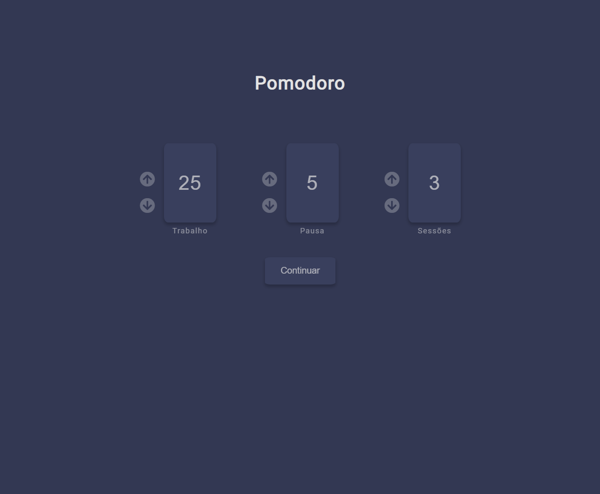
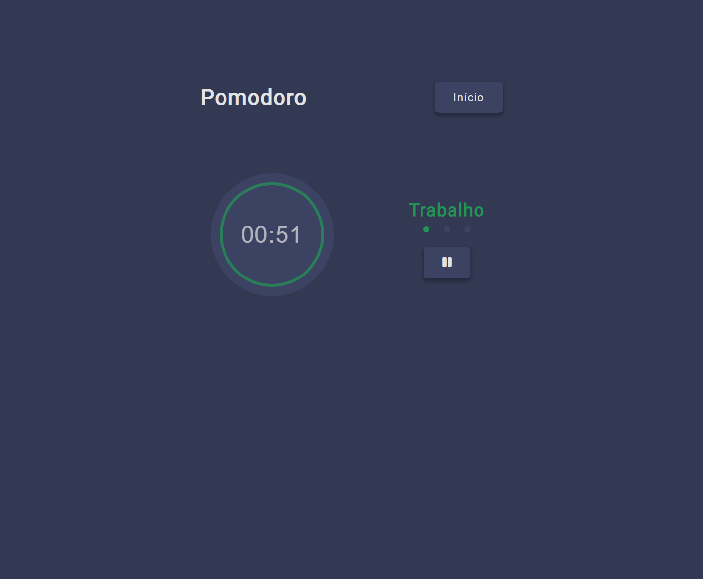
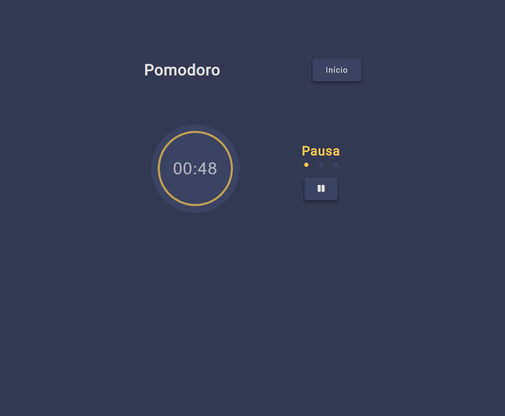
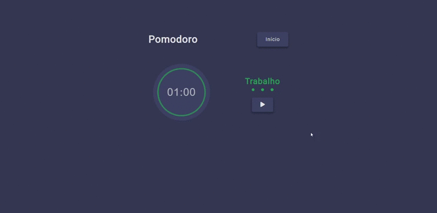
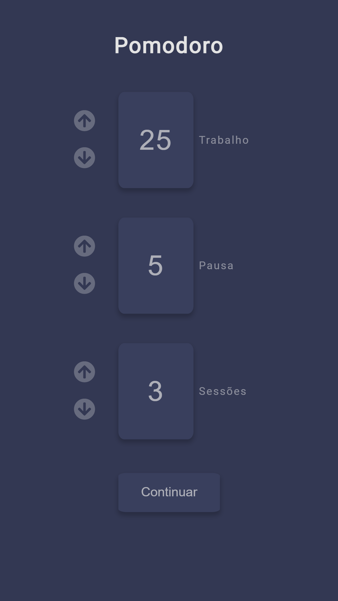
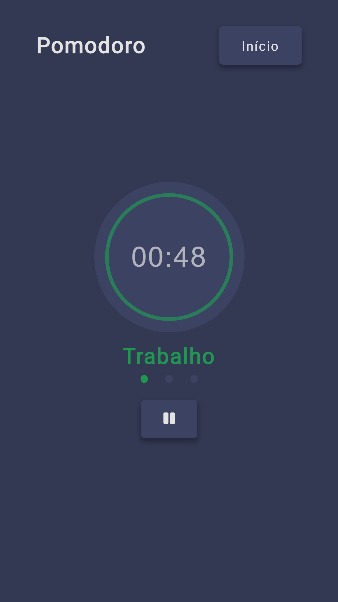
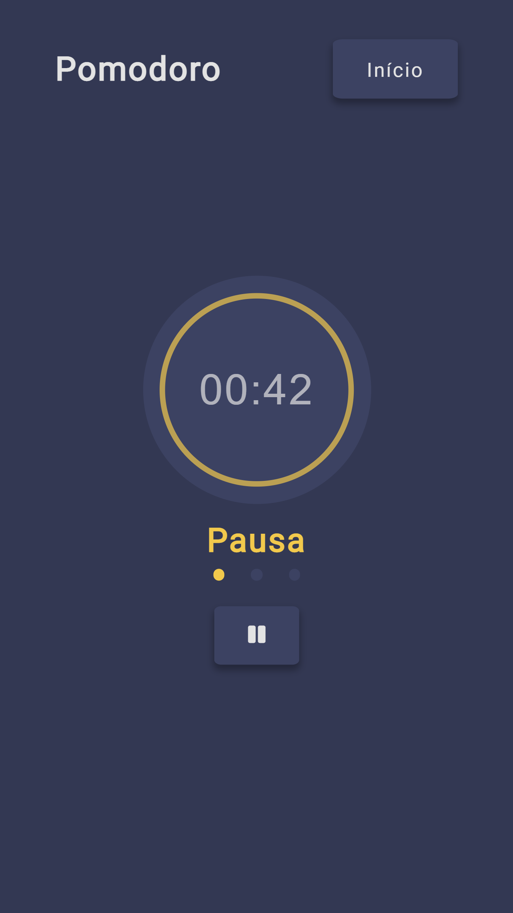
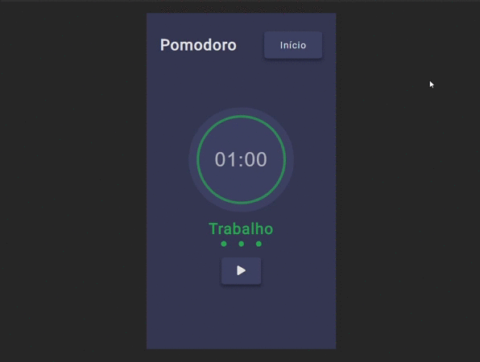

<h1 align="center">Pomodoro</h1>

Projeto baseado no desafio do <a href="https://www.devchallenge.com.br/" target="_blank">DevChallenge</a>.

  <h2>Versão Web</h2>
  
  
  
  

  <h2>Versão Mobile</h2>
  
  
  
  

<h2>🚀 Tecnologias</h2>
<ul>
  <li>HTML</li>
  <li>CSS</li>
  <li>JavaScript</li>
</ul>
<h2>🔧 Clonar Projeto</h2>
<code>git clone https://github.com/ana-ferreiramg/Pomodoro.git</code>